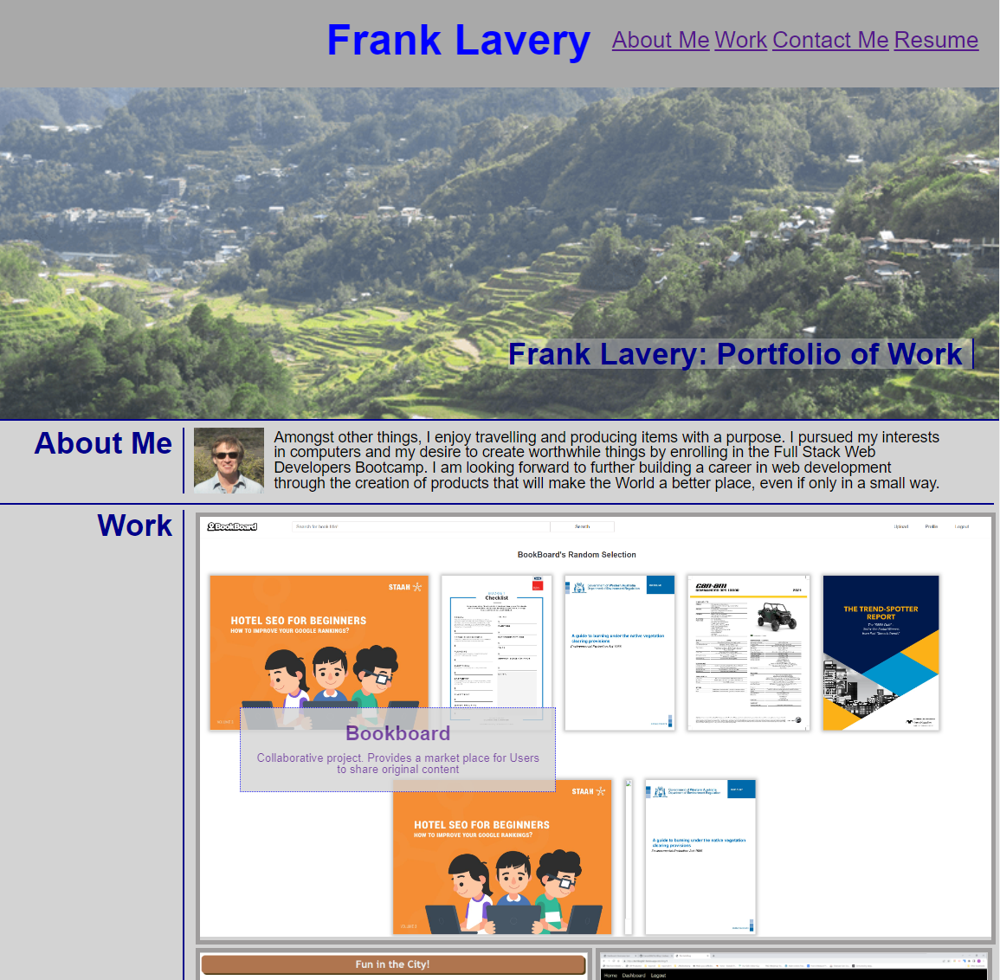

# Project Portfolio
Portfolio of my Work so Far.

## Description
This webpage sets out a portfolio of work for use by employers' in assessing the suitability of the Owner to be engaged in employment or for work on specific projects.

It provides some basic information about the candidate, links and screenshots of projects that the candidate has either worked on or completed, along with contact information such as links to Github and LinkedIn.  A section at the bottom has been provided to allow the employment history of the candidate to be added at a later stage.
 
The flagship project is presented in a larger format than the other projects.  It is designed so that projects can be updated or additional projects added at any time within the HTML, without needing to revise the CSS.

 The webpage has been updated from the previously submitted versionto utilise React components.

 The webpage uses media queries to respond to different size screens.

 Current plans are to continue to add to the portfolio, as additional projects are completed, including making updates and improvements as considered appropriate.

## Usage
The code repository is located on GitHub at:  https://github.com/Cancer2806/portfolio-react

The page is deployed using gh-pages at: https://cancer2806.github.io/portfolio-react/

## Credits
Repository for the submission of Week 20's Homework in UWA's Bootcamp series

## License
This repo is to be used only for determining the suitability of the owner for employment or engagement in a project or other enterprise
